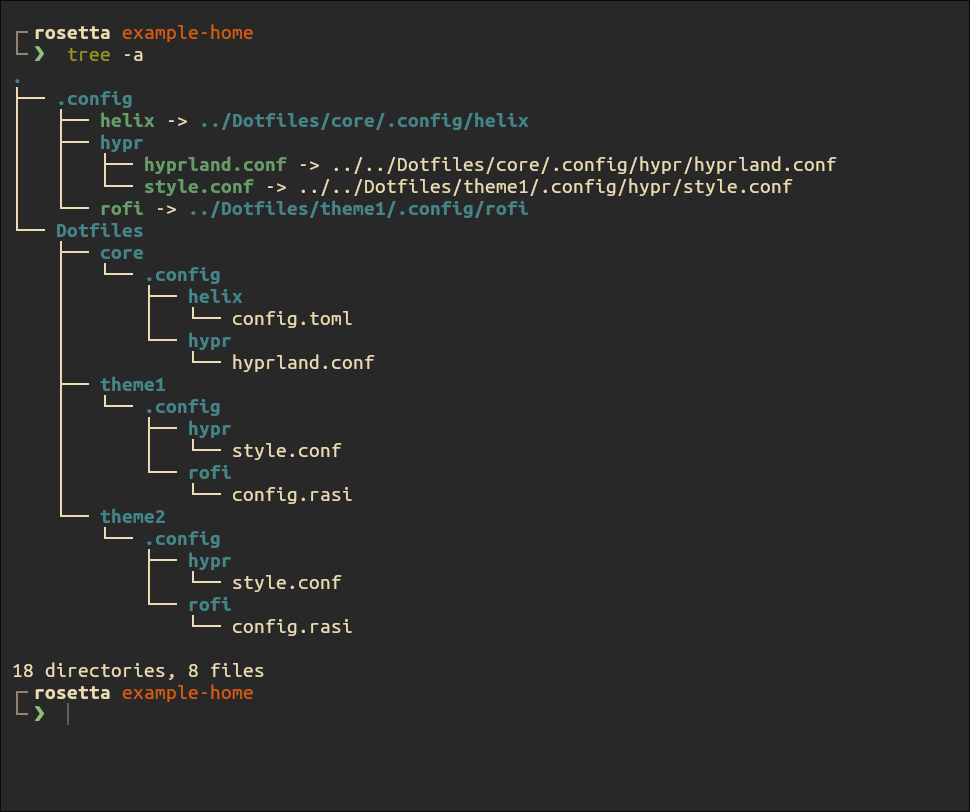

# Dotswap

dotswap.sh is a script to manage dotfiles using gnu stow and a simple neat rofi menu. 
reload.sh is a machine specific script to reload all related config files to apply them neatly. (Mine was created for my hyprland system)

<video width="688" height="288" src="https://github.com/user-attachments/assets/e444a10c-c11f-4ff0-9e3c-890c979e4191"></video>

## Dependencies

* stow
* rofi
* awk

## Note

These will need some slight customization to work on your system.

* dotswap.sh
    * name/location of dotfiles directory (default '~/Dotfiles')
    * name/location of reload.sh (default '~/.config/hypr/scripts/reload.sh')
    * name of persistant core package (default 'core')
* I would recommend creating your own reload.sh based on the tools you use.

## Dotfiles directory layout

Your dotfiles directory (dotswap defaults to ~/Dotfiles) should contain:

* a *core* package (which will always be stowed), for things like window rules or wm binds
* a directory for each config file that should change between themes

In the above example, the .config directory is entirely generated from the script 
Each package (as described by stow, in this example core, theme1, etc) is its own home directory with a .config directory and whatever else you want to change between themes 

## Tips

* **VERSION CONTROL!!!** Make your ~/Dotfiles directory a git repo, this provides backups and an easy way to restore your **entire** configuration onto a new machine
* have a .zshrc in *core* and a .zsh_prompt in each theme, and source the .zsh_prompt in the .zshrc
* in a wm, have stylistic configurations in each theme, and a binds/general config in *core*

## Contributing

Contributions welcome! Feel free to improve the script or readme in any way you see helpful, please describe your changes in your pull request!
